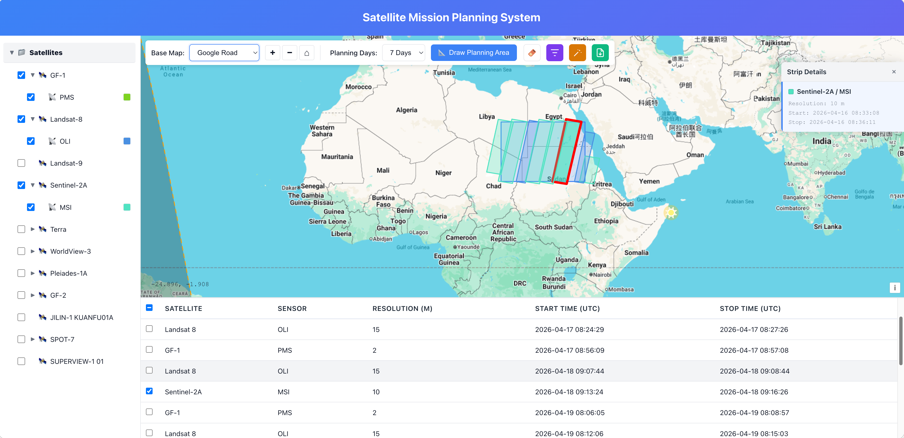

# SatPlan - Satellite Planning System (Static)

The SatPlan experience is now delivered as a static OpenLayers planner. The entire application lives under `static/`, which means the UI can be deployed directly to Cloudflare Pages, Workers, or any static host without a Go backend or database.



> This branch is a static-only variant of SatPlan, deployable to 
> Cloudflare Pages + Workers without a Go backend.  
> For the full-featured version with Go backend and Kubernetes support, 
> see the [main branch](../../tree/main).

## What's in this repo
- `static/index.html` – the single entry point with the satellite tree, controls, and the map surface.
- `static/script.js` – all the UI logic, including the embedded satellite tree and the localStorage cache guard.
- `static/styles.css` – the bespoke styles for the planner.

## Running locally
1. `cd static` (the entire UI lives inside this directory).
2. Run any static server, for example:
   ```bash
   npx http-server -p 8080
   ```
3. Open `http://localhost:8080` in a browser. The planner no longer depends on Go, JWTs, or a database.

## Customizing the satellite tree
The satellite and sensor hierarchy is still defined inside the `EMBEDDED_TREE_DATA` constant in `static/script.js`, but the UI now prefers the D1-backed catalog described below before falling back to this embedded snapshot. Update or extend the `satellite` entries (NORAD IDs, colors, TLE lines) and their child `sensor` objects (resolutions, observation angles) if you need a quick override or want to test without the API.

## TLE updates, caching, and status
- The planner automatically calls the D1-backed `/api/tle/refresh` endpoint when a planning run starts and the stored TLEs are older than eight hours relative to the planning start time.
- If the automatic refresh fails, the UI alerts the operator and continues with the latest available data.
- TLE CRUD now lives in D1: `/api/tle` supports GET/POST/PUT/DELETE, and `/api/tle/status` returns the most recent sync timestamp.

## Admin console
The repository also ships with `static/admin.html`, a browser-based admin console for maintaining the D1-backed catalog. When the Worker or Pages Functions are running, open `/admin` (or `/admin.html`) and sign in with a username/password stored in the `sys_user` table from `init.sql`. The page authenticates against `/api/admin/auth` with Basic Auth and stores the credentials in localStorage for the current browser.

Important: the lightweight `npx http-server -p 8080` workflow above is enough for viewing the planner UI, but it does not provide the `/api/admin/*` endpoints. To use the admin console locally, run the project through Wrangler so the Worker, D1 binding, and admin APIs are available.

The admin page is split into four tabs:
- `Satellites`: add, edit, and delete satellites. When creating or editing a satellite, paste a 2-line or 3-line TLE block and the form will parse the NORAD ID automatically; saving the satellite also writes the latest TLE record.
- `Sensors`: create and maintain sensor definitions for a selected satellite, including resolution, swath width, left/right side angles, observe angle, initial angle, and display color.
- `TLE Data`: review stored TLE rows, delete stale records, paste bulk 3-line TLE text for manual updates, or trigger `Auto Update` to fetch fresh orbital data from the configured external feeds.
- `TLE Sites`: manage the external TLE feed list used by automatic refreshes by adding, editing, or removing site name, source URL, and description entries.

For local development with admin features enabled, start the Worker from the repo root with your untracked local config and then visit the admin route in the browser:

```bash
npx wrangler dev --config wrangler.local.toml
```

## Twilight line visualization
- The map can render the day-night terminator (twilight line) so operators can quickly see illumination conditions on Earth.
- In normal browsing mode, the terminator is drawn using the current timeline position.
- When a planning result is available, the twilight line is no longer static: it is replayed alongside the planning timeline and updates continuously for each planning time step.
- This makes it easier to judge whether each scheduled observation window happens in daylight, nighttime, or near sunrise/sunset transition zones.

## D1-backed satellite catalog
`index.js` reads the tables inside `init.sql` and exposes a `/api/satellites` endpoint that mirrors the satellite/sensor/TLE hierarchy consumed by the planner. The endpoint is wired to the `SATPLAN_D1` binding declared in `wrangler.toml`, so deployers can ship the SQL seed, connect it to a Cloudflare D1 database, and let the UI surface live data. When the API is unreachable (for example, during local static hosting), the planner silently falls back to the embedded tree described above.

## Deploying to Cloudflare
1. Build or bundle your `static/` directory (including `index.html`, `script.js`, `styles.css`, and `tiles/`). The Pages preview now also runs the `functions/api/satellites.js` handler, so you can run `wrangler pages dev static --local` from the repo root to exercise the D1-backed tree while developing.
2. Push those files to Cloudflare Pages or reference them from a Cloudflare Worker. No backend service or database is required anymore—just serve the static files over HTTPS. Make sure the `SATPLAN_D1` binding in `wrangler.toml` points at your D1 database and that the schema from `satplan.sql` is imported into that database before publishing.
3. Ensure the `/api/tle/refresh` endpoint is reachable in production so the planner can automatically keep orbital data current.
